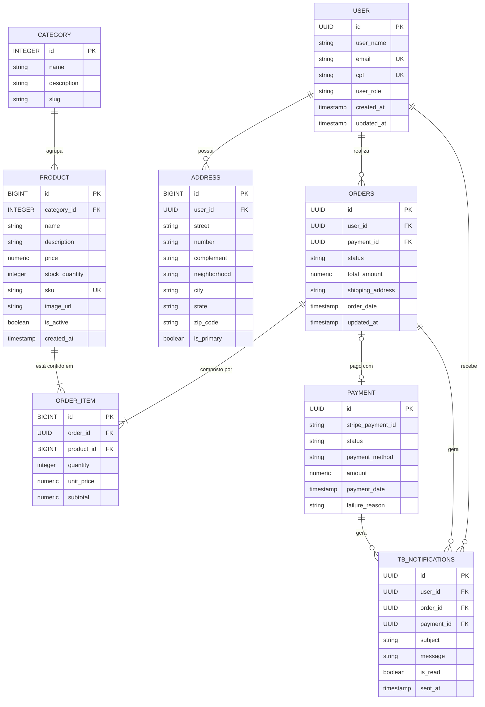

# 🛒 E-commerce API 


> API RESTful completa para gerenciamento de e-commerce, com autenticação JWT, processamento de pagamentos via Stripe, controle de estoque inteligente, notificações por email e muito mais.

---

## 📖 Sobre o Projeto

Sistema completo de e-commerce desenvolvido com **Spring Boot 3**, projetado com arquitetura em Package by Feature, padrões de projeto modernos e integração com serviços externos (Stripe para pagamentos). O sistema oferece controle completo de produtos, categorias, pedidos, estoque, pagamentos e notificações.

### 🎯 Objetivos

- Fornecer uma base sólida para aplicações de e-commerce
- Demonstrar boas práticas de desenvolvimento backend
- Implementar padrões de segurança robustos
- Integrar com serviços de pagamento reais (Stripe)
- Oferecer experiência completa de compra online

---

## ✨ Funcionalidades

### 🔐 Autenticação e Autorização
- ✅ Registro de novos usuários com validação de dados
- ✅ Login com geração de token JWT
- ✅ Controle de acesso baseado em roles (USER, ADMIN)
- ✅ Proteção de endpoints sensíveis
- ✅ Validação de CPF e email únicos

### 👤 Gerenciamento de Usuários
- ✅ CRUD completo de usuários
- ✅ Busca por email e nome (com paginação)
- ✅ Atualização de dados pessoais
- ✅ Gerenciamento de múltiplos endereços
- ✅ Histórico de pedidos do usuário

### 🏷️ Gerenciamento de Categorias
- ✅ CRUD de categorias de produtos
- ✅ Validação de nomes únicos
- ✅ Busca e listagem paginada
- ✅ Associação com produtos

### 📦 Gerenciamento de Produtos
- ✅ CRUD completo de produtos
- ✅ Controle inteligente de estoque
- ✅ Operações de estoque (ADD, REMOVE, SET)
- ✅ Busca por nome, categoria e status
- ✅ Ativação/desativação de produtos
- ✅ Validação de estoque antes de venda
- ✅ Listagem paginada e filtrada

### 🛒 Gerenciamento de Pedidos
- ✅ Criação de pedidos com múltiplos itens
- ✅ Cálculo automático de valores
- ✅ Validação de estoque disponível
- ✅ Atualização automática de estoque ao criar pedido
- ✅ Máquina de estados para status do pedido
  - `CREATED` → `PAID` → `SHIPPED` → `DELIVERED`
- ✅ Cancelamento de pedidos (com devolução de estoque)
- ✅ Busca de pedidos por usuário e status
- ✅ Histórico completo de pedidos

### 💳 Processamento de Pagamentos
- ✅ Integração real com **Stripe**
- ✅ Suporte a múltiplos métodos de pagamento:
  - Cartão de Crédito
  - Cartão de Débito
  - PIX
  - Boleto Bancário
- ✅ Validação robusta de dados de cartão
- ✅ Sealed Interfaces para tipos de pagamento (Java 17+)
- ✅ Rastreamento de transações
- ✅ Tratamento de falhas de pagamento
- ✅ Histórico de tentativas

### 📧 Sistema de Notificações
- ✅ Notificações por email (via MailHog em desenvolvimento)
- ✅ Envio assíncrono de emails
- ✅ Notificações automáticas:
  - Cadastro de novo usuário
  - Pedido criado
  - Pagamento confirmado
- ✅ Rastreamento de status de envio
- ✅ Registro de falhas

### 📊 Extras
- ✅ Cache com Redis para consultas frequentes
- ✅ Documentação interativa com Swagger/OpenAPI
- ✅ Tratamento global de exceções
- ✅ Validação robusta com Bean Validation
- ✅ Auditoria automática (createdAt, updatedAt)
- ✅ Testes unitários completos (JUnit 5 + Mockito)
- ✅ Migrações de banco de dados com Flyway
- ✅ Containerização completa com Docker Compose

---

## 🛠️ Tecnologias Utilizadas

### Backend
- **Java 21** - Linguagem de programação
- **Spring Boot 3.5.7** - Framework principal
- **Spring Data JPA** - Persistência de dados
- **Spring Security** - Autenticação e autorização
- **Spring Cache** - Sistema de cache
- **Spring Mail** - Envio de emails

### Banco de Dados
- **PostgreSQL 16** - Banco de dados relacional
- **Flyway** - Controle de migrações
- **Redis 8.2.2** - Cache distribuído

### Pagamentos
- **Stripe SDK** - Processamento de pagamentos

### Segurança
- **JWT (Auth0)** - Tokens de autenticação
- **BCrypt** - Hash de senhas

### Documentação
- **SpringDoc OpenAPI** - Documentação da API
- **Swagger UI** - Interface interativa

### DevOps
- **Docker** - Containerização
- **Docker Compose** - Orquestração de containers
- **MailHog** - Servidor SMTP de testes

### Testes
- **JUnit 5** - Framework de testes
- **Mockito** - Mocks e stubs
- **Spring Boot Test** - Testes de integração

### Validação
- **Hibernate Validator** - Bean Validation
- **Custom Validators** - Validações personalizadas (CPF, CNPJ, etc)

---

## 🏗️ Arquitetura e Modelagem

### Diagrama Entidade-Relacionamento


### Principais Entidades

#### 👤 User
| Campo | Tipo | Descrição |
|-------|------|-----------|
| id | UUID | Identificador único |
| userName | String | Nome do usuário |
| email | String | Email (único) |
| password | String | Senha (hash BCrypt) |
| cpf | String | CPF (único, opcional) |
| phoneNumber | String | Telefone |
| userRole | Enum | ADMIN ou USER |
| addresses | List\<Address\> | Endereços do usuário |
| orders | List\<Order\> | Pedidos realizados |
| createdAt | LocalDateTime | Data de criação |
| updatedAt | LocalDateTime | Última atualização |

#### 📦 Product
| Campo | Tipo | Descrição |
|-------|------|-----------|
| id | Long | Identificador único |
| name | String | Nome do produto |
| description | String | Descrição |
| price | BigDecimal | Preço unitário |
| availableQuantity | BigDecimal | Estoque disponível |
| active | Boolean | Produto ativo |
| category | Category | Categoria do produto |
| measureUnit | Enum | Unidade de medida |
| createdAt | LocalDateTime | Data de criação |
| updatedAt | LocalDateTime | Última atualização |

#### 🛒 Order
| Campo | Tipo | Descrição |
|-------|------|-----------|
| id | UUID | Identificador único |
| reference | String | Código do pedido (gerado automaticamente) |
| totalAmount | BigDecimal | Valor total |
| orderStatus | Enum | Status (CREATED, PAID, SHIPPED, DELIVERED, CANCELED) |
| user | User | Cliente que fez o pedido |
| orderItems | List\<OrderItem\> | Itens do pedido |
| payment | Payment | Pagamento associado |
| createdAt | LocalDateTime | Data de criação |
| updatedAt | LocalDateTime | Última atualização |

#### 💳 Payment
| Campo | Tipo | Descrição |
|-------|------|-----------|
| id | UUID | Identificador único |
| reference | String | Referência do pagamento |
| amount | BigDecimal | Valor pago |
| status | Enum | PENDING, PROCESSING, COMPLETED, FAILED, CANCELLED |
| paymentMethod | Enum | CREDIT_CARD, DEBIT_CARD, PIX, BOLETO |
| transactionId | String | ID da transação no Stripe |
| confirmedAt | LocalDateTime | Data de confirmação |
| failureReason | String | Motivo da falha (se houver) |
| order | Order | Pedido associado |

#### 📧 Notification
| Campo | Tipo | Descrição |
|-------|------|-----------|
| id | UUID | Identificador único |
| recipient | String | Email do destinatário |
| subject | String | Assunto do email |
| content | String | Corpo do email (HTML) |
| status | Enum | PENDING, SENT, FAILED |
| sentAt | LocalDateTime | Data de envio |
| failureReason | String | Motivo da falha |
| user | User | Usuário relacionado |
| order | Order | Pedido relacionado |
| payment | Payment | Pagamento relacionado |

---

## 📋 Pré-requisitos

- **Java 21** ou superior
- **Docker** e **Docker Compose**
- **Maven** (ou usar o Maven Wrapper incluído)
- **Conta Stripe** (para testes de pagamento)
- **IDE** recomendada: IntelliJ IDEA ou VS Code

---

## 🚀 Instalação e Execução

### 1️⃣ Clone o Repositório
```bash
git clone https://github.com/GustavoSDaniel/ecommerce-api.git
cd ecommerce-api
```

### 2️⃣ Configure as Variáveis de Ambiente

Renomeie o arquivo `variaveis-de-ambiente.example.env` para `.env` e preencha:
```env
# Credenciais do Banco de Dados PostgreSQL
POSTGRES_DB=seubancodedados
POSTGRES_USER=seuusuario
POSTGRES_PASSWORD=suasenha

# Credenciais do pgAdmin
PGADMIN_EMAIL=admin@example.com
PGADMIN_PASSWORD=admin

# Variável do JWT
JWT_SECRET=sua-chave-secreta

# Strip API Key
STRIPE_API_KEY=sk_test_SUA_CHAVE_AQUI

# Stripe webhook
STRIPE_WEBHOOK_SECRET=sua_crave_webhook
```

> ⚠️ **IMPORTANTE:** Nunca comite o arquivo `.env` no Git! Ele contém informações sensíveis.

### 3️⃣ Executar com Docker (Recomendado)
```bash
# Subir todos os serviços
docker compose up -d --build

# Ver logs
docker compose logs -f ecommerce-app

# Parar os serviços
docker compose down

# Parar e remover volumes (limpa o banco)
docker compose down -v
```

A aplicação estará disponível em: **http://localhost:5050**

### 4️⃣ Executar Localmente (IDE)

**Passo 1:** Suba apenas os serviços de infraestrutura:
```bash
docker compose up -d postgres redis mailhog pgadmin
```

**Passo 2:** Configure sua IDE:

**IntelliJ IDEA:**
1. Instale o plugin **EnvFile**
2. Vá em `Run → Edit Configurations...`
3. Selecione `Application` (ou crie uma nova)
4. Na aba **EnvFile**, clique em `+` e adicione o arquivo `.env`
5. Em **Active profiles**, digite: `local`
6. Clique em **Apply** e **OK**

**VS Code:**
1. Instale a extensão **DotENV**
2. Configure o `launch.json`:
```json
{
  "configurations": [
    {
      "type": "java",
      "name": "Spring Boot App",
      "request": "launch",
      "mainClass": "com.gustavosdaniel.ecommerce_api.Application",
      "envFile": "${workspaceFolder}/.env",
      "vmArgs": "-Dspring.profiles.active=local"
    }
  ]
}
```

**Passo 3:** Execute a classe `Application.java`

A aplicação estará disponível em: **http://localhost:5050**

---

## 🌐 Endpoints da API

A URL base é: `http://localhost:5050/api`

### 🔐 Autenticação (`/auth`)

| Método | Endpoint | Descrição | Acesso |
|--------|----------|-----------|--------|
| POST | `/auth/register` | Registra novo usuário | Público |
| POST | `/auth/login` | Autentica e retorna token JWT | Público |

**Exemplo - Registro:**
```json
POST /api/auth/register
{
  "userName": "João Silva",
  "email": "joao@example.com",
  "password": "Senha@123",
  "cpf": "12345678900"
}
```

**Exemplo - Login:**
```json
POST /api/auth/login
{
  "email": "joao@example.com",
  "password": "Senha@123"
}

// Resposta
{
  "token": "eyJhbGciOiJIUzI1NiIsInR5cCI6IkpXVCJ9...",
  "type": "Bearer"
}
```

### 👤 Usuários (`/users`)

| Método | Endpoint | Descrição | Acesso |
|--------|----------|-----------|--------|
| GET | `/users` | Lista usuários (paginado) | Autenticado |
| GET | `/users/{id}` | Busca usuário por ID | Autenticado |
| GET | `/users/email?email={email}` | Busca por email | Autenticado |
| PUT | `/users/{id}` | Atualiza usuário | Próprio usuário ou ADMIN |
| DELETE | `/users/{id}` | Deleta usuário | Próprio usuário ou ADMIN |

### 🏷️ Categorias (`/categories`)

| Método | Endpoint | Descrição | Acesso |
|--------|----------|-----------|--------|
| POST | `/categories` | Cria categoria | ADMIN |
| GET | `/categories` | Lista categorias | Público |
| GET | `/categories/{id}` | Busca por ID | Público |
| PUT | `/categories/{id}` | Atualiza categoria | ADMIN |
| DELETE | `/categories/{id}` | Deleta categoria | ADMIN |

### 📦 Produtos (`/products`)

| Método | Endpoint | Descrição | Acesso |
|--------|----------|-----------|--------|
| POST | `/products` | Cria produto | ADMIN |
| GET | `/products` | Lista produtos | Público |
| GET | `/products/{id}` | Busca por ID | Público |
| GET | `/products/active` | Lista produtos ativos | Público |
| GET | `/products/category/{categoryId}` | Produtos por categoria | Público |
| GET | `/products/search?name={name}` | Busca por nome | Público |
| PUT | `/products/{id}` | Atualiza produto | ADMIN |
| PATCH | `/products/{id}/stock` | Atualiza estoque | ADMIN |
| PATCH | `/products/{id}/activate` | Ativa produto | ADMIN |
| PATCH | `/products/{id}/deactivate` | Desativa produto | ADMIN |
| DELETE | `/products/{id}` | Deleta produto | ADMIN |

**Exemplo - Atualizar Estoque:**
```json
PATCH /api/products/1/stock
{
  "quantity": 50,
  "stockOperationType": "ADD"  // ou REMOVE, SET
}
```

### 🛒 Pedidos (`/orders`)

| Método | Endpoint | Descrição | Acesso |
|--------|----------|-----------|--------|
| POST | `/orders` | Cria pedido | Autenticado |
| GET | `/orders/my-orders` | Meus pedidos | Autenticado |
| GET | `/orders/{id}` | Busca por ID | Próprio pedido ou ADMIN |
| DELETE | `/orders/{id}/cancel` | Cancela pedido | Próprio pedido |

**Exemplo - Criar Pedido:**
```json
POST /api/orders
{
  "itens": [
    {
      "productId": 1,
      "quantity": 2
    },
    {
      "productId": 5,
      "quantity": 1
    }
  ]
}
```

### 💳 Pagamentos (`/payments`)

| Método | Endpoint | Descrição | Acesso |
|--------|----------|-----------|--------|
| POST | `/payments/orders/{orderId}/confirm` | Processa pagamento | Autenticado |
| GET | `/payments/{id}` | Busca pagamento | Autenticado |
| GET | `/payments/order/{orderId}` | Pagamento por pedido | Autenticado |

**Exemplo - Pagamento com Cartão:**
```json
POST /api/payments/orders/{orderId}/confirm
{
  "details": {
    "method": "CREDIT_CARD",
    "cardNumber": "4242424242424242",
    "cardHolderName": "JOAO SILVA",
    "expiryDate": "12/25",
    "cvv": "123"
  }
}
```

**Exemplo - Pagamento PIX:**
```json
POST /api/payments/orders/{orderId}/confirm
{
  "details": {
    "method": "PIX",
    "payerName": "João Silva",
    "payerDocument": "12345678900"
  }
}
```

### 📍 Endereços (`/addresses`)

| Método | Endpoint | Descrição | Acesso |
|--------|----------|-----------|--------|
| POST | `/addresses` | Cria endereço | Autenticado |
| GET | `/addresses/my-addresses` | Meus endereços | Autenticado |
| PUT | `/addresses/{id}` | Atualiza endereço | Próprio endereço |
| DELETE | `/addresses/{id}` | Deleta endereço | Próprio endereço |

---

## 🧪 Testando a API

### 📄 Swagger UI (Recomendado)

Acesse: **http://localhost:5050/swagger-ui.html**

1. Clique em **Authorize** (cadeado)
2. Cole seu token JWT no formato: `Bearer seu_token_aqui`
3. Teste os endpoints diretamente na interface

### 📬 Postman / Insomnia

Importe a collection disponível em: `/docs/postman-collection.json` (se disponível)

Ou configure manualmente:
1. Crie uma requisição POST para `/api/auth/login`
2. Salve o token retornado
3. Adicione o header em outras requisições:
```
   Authorization: Bearer seu_token_aqui
```

### 🔧 cURL
```bash
# Login
curl -X POST http://localhost:5050/api/auth/login \
  -H "Content-Type: application/json" \
  -d '{"email":"seu@email.com","password":"sua_senha"}'

# Buscar produtos (com token)
curl -X GET http://localhost:5050/api/products \
  -H "Authorization: Bearer seu_token_aqui"
```

### 📧 Testando Emails

Acesse o **MailHog UI**: **http://localhost:5055**

Todos os emails enviados pela aplicação aparecerão aqui (não são enviados de verdade em ambiente de desenvolvimento).

### 💳 Testando Pagamentos (Stripe)

Use os **cartões de teste do Stripe**:

| Cenário | Número do Cartão | CVV | Validade |
|---------|------------------|-----|----------|
| ✅ Aprovado | `4242 4242 4242 4242` | Qualquer | Futuro |
| ❌ Recusado | `4000 0000 0000 0002` | Qualquer | Futuro |
| ⚠️ 3D Secure | `4000 0025 0000 3155` | Qualquer | Futuro |

---

## 🌟 Diferenciais do Projeto

### ✨ Técnicos

- 🎯 **Arquitetura em Package by Feature** - Separação clara de responsabilidades
- 🧠 **Rich Domain Model** - Lógica de negócio nas entidades
- 🔒 **Sealed Interfaces** - Type-safety nos tipos de pagamento (Java 17+)
- 🎨 **DTOs com Records** - Imutabilidade e menos boilerplate
- 🔄 **Máquina de Estados** - Controle de transições de status
- ⚡ **Cache Inteligente** - Redis para otimização de consultas
- 🧪 **Testes Completos** - Cobertura de todas as camadas
- 📝 **Documentação Viva** - Swagger/OpenAPI atualizado automaticamente
- 🐳 **Full Docker** - Ambiente reproduzível facilmente

### 💡 De Negócio

- 💳 **Integração Real com Stripe** - Pagamentos reais de produção
- 📦 **Controle de Estoque Inteligente** - Operações atômicas e validações
- 📧 **Notificações Automáticas** - Emails em eventos importantes
- 🛡️ **Segurança Robusta** - JWT, BCrypt, validações em todas as camadas
- 🔄 **Auditoria Completa** - Rastreamento de todas as ações
- 📊 **Histórico Detalhado** - Todas as transações registradas

---

## 📂 Estrutura do Projeto
```
ecommerce-api/
├── src/
│   ├── main/
│   │   ├── java/com/gustavosdaniel/ecommerce_api/
│   │   │   ├── address/          # Endereços
│   │   │   ├── auth/             # Autenticação
│   │   │   ├── category/         # Categorias
│   │   │   ├── config/           # Configurações (Security, Cache, Email, etc)
│   │   │   ├── exception/        # Tratamento de erros
│   │   │   ├── notification/     # Notificações
│   │   │   ├── order/            # Pedidos
│   │   │   │   └── orderItem/    # Itens do pedido
│   │   │   ├── payment/          # Pagamentos
│   │   │   ├── product/          # Produtos
│   │   │   ├── user/             # Usuários
│   │   │   └── util/             # Utilitários
│   │   └── resources/
│   │       ├── db.migration/     # Migrações Flyway
│   │       ├── templates
│   │       ├── application.yml   # Config local
│   │       └── application-docker.yml
│   └── test/                     # Testes unitários
├── docker-compose.yml            # Orquestração Docker
├── Dockerfile                    # Build da aplicação
├── .env.example                  # Exemplo de variáveis
├── pom.xml                       # Dependências Maven
└── README.md                     # Este arquivo
```

---

## 🔗 Acesso aos Serviços

| Serviço | URL | Credenciais |
|---------|-----|-------------|
| **API REST** | http://localhost:5050 | - |
| **Swagger UI** | http://localhost:5050/swagger-ui.html | - |
| **PostgreSQL** | localhost:5051 | Ver `.env` |
| **PgAdmin** | http://localhost:5052 | Ver `.env` |
| **Redis** | localhost:5053 | - |
| **MailHog UI** | http://localhost:5055 | - |
| **MailHog SMTP** | localhost:5054 | - |

---

## 🤝 Contribuindo

Contribuições são sempre bem-vindas!

1. Faça um Fork do projeto
2. Crie uma branch para sua feature (`git checkout -b feature/NovaFuncionalidade`)
3. Commit suas mudanças (`git commit -m 'Adiciona nova funcionalidade'`)
4. Push para a branch (`git push origin feature/NovaFuncionalidade`)
5. Abra um Pull Request

### 📋 Diretrizes

- Siga os padrões de código existentes
- Adicione testes para novas funcionalidades
- Atualize a documentação quando necessário
- Faça commits semânticos e descritivos

---

## 📄 Licença

Este projeto está sob a licença MIT. Veja o arquivo [LICENSE](LICENSE) para mais detalhes.

---

## 👨‍💻 Autor

**Gustavo Silva Daniel**

- GitHub: [@GustavoSDaniel](https://github.com/GustavoSDaniel)
- LinkedIn: [Gustavo Silva Daniel](https://www.linkedin.com/in/gustavo-silva-daniel-a778b7331/)
- Email: gustavosdaniel@hotmail.com

---

## 🙏 Agradecimentos

- [Spring Boot](https://spring.io/projects/spring-boot) - Framework incrível
- [Stripe](https://stripe.com) - API de pagamentos
- [MailHog](https://github.com/mailhog/MailHog) - Teste de emails
- Comunidade Open Source

---

## 🏷️ Tags

`#Java` `#SpringBoot` `#Ecommerce` `#API` `#RestAPI` `#Docker` 
`#PostgreSQL` `#Redis` `#Stripe` `#JWT` `#SpringSecurity` 
`#Flyway` `#Swagger` `#MailHog` `#Thymeleaf` `#JUnit` `#Mockito`

---

<div align="center">
  
  ⭐ **Se este projeto te ajudou, deixe uma estrela!** ⭐
  
  **Desenvolvido com ❤️ e ☕**
  
</div>
